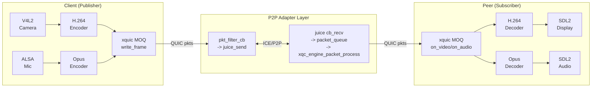

# P2P A/V Client and Peer Implementation

## Architecture Overview




## Files to Create/Modify

### New modules in `p2p/`

- `**p2p/include/p2p_av_capture.h**` + `**p2p/src/p2p_av_capture.c**` -- V4L2 video capture (YUYV/MJPEG) and ALSA audio capture (S16LE PCM). Runs dedicated threads, delivers raw frames via callback.
- `**p2p/include/p2p_av_codec.h**` + `**p2p/src/p2p_av_codec.c**` -- FFmpeg-based H.264 encoder/decoder + Opus encoder/decoder. The encoder uses `libx264` with `zerolatency` tune and `ultrafast` preset for minimal encoding delay. IDR frame interval set to 1 second (GOP = fps) so keyframe arrives within 1s. Decoder uses `h264` + `libopus`.
- `**p2p/include/p2p_sdl_render.h**` + `**p2p/src/p2p_sdl_render.c**` -- SDL2 video rendering (YUV texture) and audio playback (SDL audio queue). Handles SDL event loop. Uses `SDL_UpdateYUVTexture` for zero-copy YUV display.
- `**p2p/src/p2p_client.c**` -- Publisher main program. Flow: init adapter engine -> connect signaling -> create room -> on subscriber join: ICE exchange -> ICE connected -> start QUIC -> MOQ session (publisher) -> create video+audio tracks -> capture loop: V4L2 frame -> encode H.264 -> `juice_send()` with frame header; ALSA PCM -> encode Opus -> `juice_send()`.
- `**p2p/src/p2p_peer.c**` -- Subscriber main program. Flow: init adapter engine -> connect signaling -> join room -> ICE exchange -> ICE connected -> start QUIC -> MOQ session (subscriber) -> subscribe tracks -> on_video callback: decode H.264 -> SDL2 display; on_audio callback: decode Opus -> SDL2 audio.

### Modifications to existing files

- `**[p2p/src/p2p_adapter.c](p2p/src/p2p_adapter.c)**` -- Enhance `xqc_server_accept_cb` to associate incoming connections with the correct peer context based on virtual address. Add `on_peer_data_recv` callback to `p2p_adapter_callbacks_t` so the client/peer can receive raw application data through the adapter when xquic/MOQ is not used (fallback mode).
- `**[p2p/include/p2p_adapter.h](p2p/include/p2p_adapter.h)**` -- Add `on_peer_data_recv` callback. Add `p2p_peer_send_data()` function for sending raw framed data through ICE channel directly (used when xquic is not available).
- `**[p2p/CMakeLists.txt](p2p/CMakeLists.txt)**` -- Add new source files. Add `pkg-config` for FFmpeg (`libavcodec`, `libavutil`, `libswscale`, `libswresample`), SDL2, and ALSA. Add `p2p_client` and `p2p_peer` executable targets.
- `**[tests/CMakeLists.txt](tests/CMakeLists.txt)**` -- Add `p2p_client` and `p2p_peer` targets.

## Data Framing Protocol (over ICE channel)

Since xquic requires SSL/TLS which may not be built, the client/peer will use a **dual-mode design**:

- **Mode A (xquic MOQ)**: When xquic is fully linked. Uses `xqc_moq_write_video_frame()` / `on_video_frame` callbacks. Packets flow through xquic -> pkt_filter -> juice_send.
- **Mode B (direct framing)**: When xquic is not available. Sends frames directly via `juice_send()` with a lightweight header:

```c
typedef struct __attribute__((packed)) {
    uint8_t  type;           // 0x01=video, 0x02=audio
    uint8_t  flags;          // bit0=keyframe
    uint32_t seq;            // sequence number
    uint64_t timestamp_us;   // capture timestamp
    uint32_t payload_len;    // payload size
} p2p_frame_header_t;       // 18 bytes, followed by encoded payload
```

This dual-mode ensures the system works end-to-end even if xquic/SSL build is pending, while providing the full xquic MOQ path when available.

## Latency Optimization Strategy (target: under 500ms)

- **V4L2**: request low-latency MJPEG or YUYV capture with small buffer count (2 buffers)
- **H.264 encoder**: `x264` with `tune=zerolatency`, `preset=ultrafast`, `rc=cbr`, `keyint=fps` (1-second GOP)
- **Transport**: libjuice ICE direct path has ~1-5ms LAN / 20-80ms WAN latency
- **Decoder**: `h264` decoder with `flags2=fast`, no B-frames (guaranteed by zerolatency encoder)
- **SDL2 render**: immediate texture update, no vsync wait
- **Audio**: SDL audio buffer set to 20ms (960 samples at 48kHz)

## First-Frame Optimization (target: sub-second)

- Publisher caches the latest H.264 IDR frame
- When a new subscriber connects and ICE establishes, the cached IDR is sent immediately before starting the live stream
- GOP interval = 1 second ensures a new keyframe arrives within 1s even without the cache
- Subscriber's decoder is initialized on first frame receipt

## Thread Model

**Client (Publisher):**

```
Main thread:      signaling + control loop
V4L2 thread:      capture -> encode video -> send
ALSA thread:      capture -> encode audio -> send
Engine thread:    xquic timer + packet processing (existing)
libjuice thread:  ICE internal (existing)
```

**Peer (Subscriber):**

```
Main thread:      SDL2 event loop + render (SDL2 MUST run on main thread)
Signaling thread: signaling recv
Engine thread:    xquic timer + packet processing -> decode -> queue to main
libjuice thread:  ICE internal (existing)
```

## Key Implementation Details

### V4L2 capture (`p2p_av_capture.c`)

- Open `/dev/video0`, set format to YUYV 640x480 or MJPEG
- Use `mmap` + `VIDIOC_QBUF`/`DQBUF` streaming
- 2 buffers for minimal latency
- Dedicated capture thread calling `select()` + `DQBUF`
- Delivers frames via callback to encoder

### ALSA capture (`p2p_av_capture.c`)

- Open `default` PCM device, S16_LE, 48000Hz, mono
- Period size 960 frames (20ms)
- Dedicated thread calling `snd_pcm_readi()`
- Delivers PCM buffers to encoder

### H.264 encoder (`p2p_av_codec.c`)

- `avcodec_find_encoder_by_name("libx264")`
- Pixel format: `AV_PIX_FMT_YUV420P`
- Bitrate: 1 Mbps default, configurable
- Key settings: `tune=zerolatency`, `preset=ultrafast`, `keyint=30`, `bframes=0`
- Input: convert YUYV->YUV420P via `sws_scale` if needed

### Opus encoder (`p2p_av_codec.c`)

- `avcodec_find_encoder(AV_CODEC_ID_OPUS)`
- Sample rate 48000, mono, 64kbps
- Frame size 960 samples (20ms)

### SDL2 renderer (`p2p_sdl_render.c`)

- Window 640x480, YUV overlay texture
- `SDL_CreateTexture(SDL_PIXELFORMAT_IYUV)`
- `SDL_UpdateYUVTexture()` + `SDL_RenderCopy()` + `SDL_RenderPresent()`
- Audio: `SDL_OpenAudioDevice()` with 48kHz S16 mono, queue audio via `SDL_QueueAudio()`

### Command line interface

```
# Client (Publisher)
./p2p_client --signaling 127.0.0.1:8080 --room test-room --peer-id pub1 \
    --video-dev /dev/video0 --audio-dev default \
    --stun stun.l.google.com:19302

# Peer (Subscriber)  
./p2p_peer --signaling 127.0.0.1:8080 --room test-room --peer-id sub1 \
    --stun stun.l.google.com:19302
```

