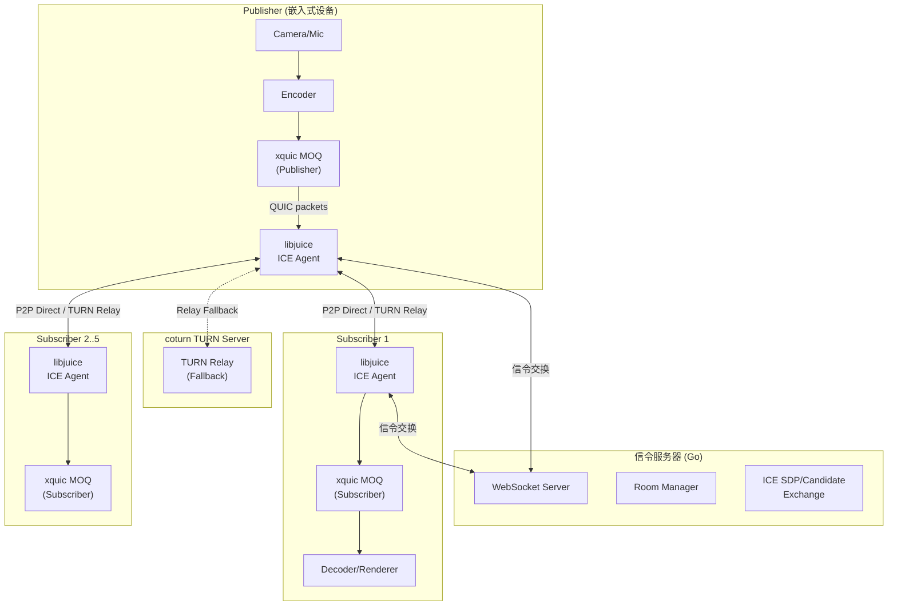
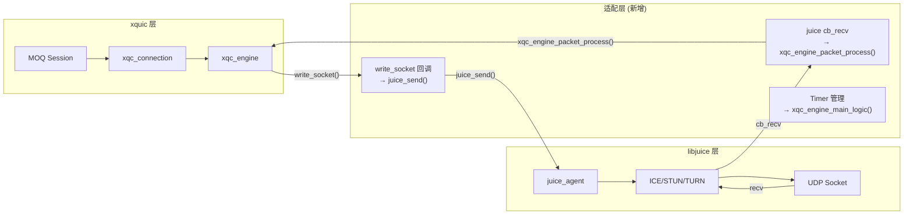
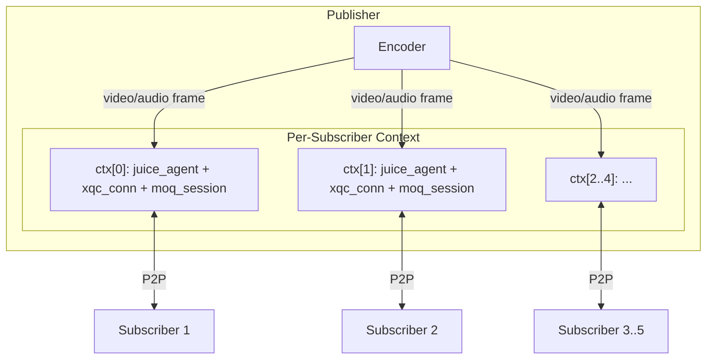

# XQUIC over libjuice 嵌入式 P2P 音视频传输框架

## 一、本地代码架构分析

### 1. libjuice 架构 (`libjuice/`)

libjuice 是一个轻量级 ICE 库，核心模块：

- **公共 API** (`include/juice/juice.h`): `juice_create()` / `juice_destroy()` / `juice_send()` / `juice_gather_candidates()` 等
- **ICE Agent** (`src/agent.c`): 负责 STUN/TURN 候选收集、连通性检查、候选对选择
- **连接层** (`src/conn.c`, `conn_poll.c`, `conn_thread.c`, `conn_mux.c`): 三种并发模式 (Poll/Thread/Mux)
- **STUN/TURN 协议** (`src/stun.c`, `src/turn.c`): 完整的 STUN/TURN 客户端实现
- **内置 TURN 服务器** (`src/server.c`): 轻量级 TURN 服务器实现
- **UDP 管理** (`src/udp.c`): Socket 创建、非阻塞 I/O、地址绑定

**关键回调模型：**

```c
juice_config_t config = {
    .cb_state_changed = ...,  // ICE 状态变化
    .cb_candidate     = ...,  // 候选发现
    .cb_gathering_done = ..., // 候选收集完成
    .cb_recv          = ...,  // 应用数据接收 (关键整合点)
};
```

**数据通道：** ICE 连接建立后，`juice_send(agent, data, size)` 发送数据，`cb_recv` 回调接收数据。所有数据均通过 ICE 选定的候选对传输（直连或 TURN 中继）。

### 2. xquic 架构 (`xquic/`)

xquic 是阿里巴巴的 QUIC/HTTP3 实现，核心模块：

- **Engine** (`src/transport/xqc_engine.c`): 全局引擎管理
- **Connection** (`src/transport/xqc_conn.c`): QUIC 连接管理
- **Stream** (`src/transport/xqc_stream.c`): QUIC 流管理
- **Datagram** (`src/transport/xqc_datagram.c`): QUIC Datagram 扩展
- **MOQ** (`moq/`): Media over QUIC 实现，支持 Publisher/Subscriber 模型
- **拥塞控制** (`src/congestion_control/`): BBR, Cubic, Copa 等

**关键传输回调（整合核心）：**

```c
typedef ssize_t (*xqc_socket_write_pt)(const unsigned char *buf, size_t size,
    const struct sockaddr *peer_addr, socklen_t peer_addrlen, void *conn_user_data);
```

xquic 不直接操作 socket，而是通过 `write_socket` 回调将 QUIC 包交给应用层发送。

**包接收入口：**

```c
xqc_engine_packet_process(engine, packet_buf, size, local_addr, ..., peer_addr, ..., recv_time, user_data);
```

**Per-connection 过滤回调（替代全局 write_socket）：**

```c
xqc_conn_set_pkt_filter_callback(conn, pf_cb, pf_cb_user_data);
```

### 3. coturn 架构 (`coturn/`)

coturn 是生产级 TURN/STUN 服务器：

- **核心服务器** (`src/apps/relay/`): `mainrelay.c` 主入口，`netengine.c` 网络引擎
- **TURN 会话管理** (`src/server/ns_turn_server.c`, `ns_turn_session.h`): 分配、权限、通道绑定
- **消息处理** (`src/client/ns_turn_msg.c`): STUN/TURN 消息编解码
- **数据库驱动** (`src/apps/relay/dbdrivers/`): Redis, PostgreSQL, MySQL, MongoDB, SQLite
- **TLS/DTLS** (`src/apps/relay/tls_listener.c`, `dtls_listener.c`)

coturn 作为独立部署的 TURN 服务器，为 libjuice agent 提供 relay 候选。

### 4. xquic MOQ 层 (Media over QUIC)

xquic 内置了 MOQ 层，天然支持 Publisher/Subscriber 模型：

- **Track 模型**: `xqc_moq_track_create()` 创建音/视频 Track
- **发布/订阅**: `xqc_moq_subscribe()` / `xqc_moq_write_video_frame()` / `xqc_moq_write_audio_frame()`
- **会话回调**: `xqc_moq_session_callbacks_t` 包含 `on_subscribe`, `on_video`, `on_audio`, `on_catalog` 等
- **角色定义**: `XQC_MOQ_PUBLISHER`, `XQC_MOQ_SUBSCRIBER`, `XQC_MOQ_PUBSUB`
- **码率自适应**: `xqc_moq_configure_bitrate()`, `xqc_moq_target_bitrate()`

---

## 二、整体架构设计




---

## 三、核心整合方案：xquic over libjuice

### 整合原理

将 libjuice 的 ICE 数据通道作为 xquic 的 UDP 传输层：




### 适配层关键代码设计

**1. 发送适配 (xquic → libjuice):**

```c
static ssize_t ice_write_socket(const unsigned char *buf, size_t size,
    const struct sockaddr *peer_addr, socklen_t peer_addrlen, void *conn_user_data) {
    p2p_context_t *ctx = (p2p_context_t *)conn_user_data;
    int ret = juice_send(ctx->ice_agent, (const char *)buf, size);
    return (ret == 0) ? (ssize_t)size : XQC_SOCKET_ERROR;
}
```

**2. 接收适配 (libjuice → xquic):**

```c
static void on_ice_recv(juice_agent_t *agent, const char *data, size_t size, void *user_ptr) {
    p2p_context_t *ctx = (p2p_context_t *)user_ptr;
    xqc_engine_packet_process(ctx->engine, (unsigned char *)data, size,
        &ctx->local_addr, ctx->local_addrlen,
        &ctx->peer_addr, ctx->peer_addrlen,
        xqc_now(), ctx);
    xqc_engine_finish_recv(ctx->engine);
}
```

**3. 地址映射问题：** libjuice 在 ICE 连接建立后抽象了底层地址。xquic 的 `peer_addr` 参数需要使用虚拟地址（如 127.0.0.1:固定端口），因为实际寻址由 libjuice ICE agent 管理。每个 ICE agent 对应一个 xquic connection，通过 `conn_user_data` 关联。

---

## 四、信令服务器设计 (Go 语言)

### 功能模块

- **WebSocket 通信层**: 客户端通过 WebSocket 连接信令服务器
- **房间管理**: Publisher 创建房间，Subscriber 加入房间（1对多，最多5个 Subscriber）
- **ICE 信令交换**: 转发 SDP description 和 ICE candidate
- **TURN 凭证分发**: 动态生成 coturn TURN 凭证
- **心跳/健康检查**: 连接保活和超时清理

### 信令协议 (JSON over WebSocket)

```
消息类型:
- join_room      : Subscriber 加入房间
- create_room    : Publisher 创建房间
- ice_offer      : 发送 ICE SDP offer
- ice_answer     : 发送 ICE SDP answer
- ice_candidate  : 发送 ICE candidate
- gathering_done : 候选收集完成通知
- turn_credentials : TURN 凭证分发
- room_info      : 房间状态通知
- leave_room     : 离开房间
- heartbeat      : 心跳
```

### 目录结构

```
signaling-server/
├── go.mod
├── main.go
├── config/
│   └── config.go          # 配置管理
├── handler/
│   └── ws_handler.go      # WebSocket 处理
├── model/
│   └── message.go         # 消息定义
├── room/
│   └── manager.go         # 房间管理 (1:N)
├── turn/
│   └── credentials.go     # coturn 凭证生成 (HMAC-SHA1 临时凭证)
└── ice/
    └── exchange.go         # ICE 信令交换逻辑
```

---

## 五、关键技术决策和建议

### 1. P2P 直连率 95% 优化策略

- **多候选类型收集**: host + srflx + relay 全部收集，优先 host/srflx 直连
- **Aggressive Nomination**: 使用 ICE aggressive nomination 加速连接建立
- **STUN 服务器多选**: 配置多个 STUN 服务器提高 srflx 候选获取成功率
- **IPv4/IPv6 双栈**: libjuice 支持 dual-stack，利用 IPv6 提高穿透率
- **coturn 仅作为 fallback**: relay 候选优先级最低，确保 95%+ 场景走直连

### 2. 秒级首帧加载优化

- **ICE 并行收集**: Publisher 预先收集候选，Subscriber 加入时直接交换
- **0-RTT QUIC**: xquic 支持 0-RTT，结合 session ticket 减少握手延迟
- **IDR 帧缓存**: Publisher 缓存最近一个 IDR 帧，Subscriber 连接后立即推送
- **MOQ `LAST_GROUP` 过滤器**: Subscriber 使用 `XQC_MOQ_FILTER_LAST_GROUP` 从最近的 GOP 开始接收

### 3. 1对多模式设计

Publisher 为每个 Subscriber 维护独立的：

- libjuice ICE agent
- xquic connection (通过 `pkt_filter_callback` 或独立 engine)
- MOQ session




### 4. 地址映射方案

由于 libjuice 抽象了底层 UDP socket，xquic 无法直接操作 socket fd。建议方案：

- **方案 A (推荐): Per-connection pkt_filter_callback** -- 使用 `xqc_conn_set_pkt_filter_callback()` 为每个连接设置独立的发送回调，回调内调用对应 ICE agent 的 `juice_send()`。1个 xquic engine + N个连接，每个连接关联一个 ICE agent。
- **方案 B: 多 Engine** -- 每个 Subscriber 独立 xquic engine，通过全局 `write_socket` 回调发送。简单但资源开销较大。

### 5. 线程模型建议

```
主线程/事件循环:
  ├── libjuice (POLL 模式，共享线程)
  │     ├── ICE Agent 1 (Subscriber 1)
  │     ├── ICE Agent 2 (Subscriber 2)
  │     └── ...
  ├── xquic engine (单线程)
  │     ├── timer callback → xqc_engine_main_logic()
  │     ├── connection 1 (pkt_filter → juice_send via agent 1)
  │     └── connection 2 (pkt_filter → juice_send via agent 2)
  └── 信令 WebSocket 客户端
```

由于 libjuice 的 `cb_recv` 在 libjuice 内部线程触发，而 `xqc_engine_packet_process()` 需要在 xquic engine 线程调用，需要通过线程安全队列将收到的包从 libjuice 线程传递到 xquic engine 线程。

### 6. MTU 和分片

- libjuice ICE 数据通道 MTU 约 1280 字节（IPv6 最小 MTU）
- xquic QUIC 包不应超过 ICE 通道 MTU
- 建议设置 `xqc_conn_settings_t.max_udp_payload_size = 1200` 确保 QUIC 包不超过 ICE MTU

---

## 六、部署架构

```
┌─────────────┐     ┌──────────────────┐     ┌─────────────┐
│  Publisher   │     │  Cloud Infra     │     │ Subscriber  │
│  (嵌入式)    │     │                  │     │  (App/Web)  │
│             │     │ ┌──────────────┐ │     │             │
│ libjuice ◄──┼─────┼─┤ 信令 Server  ├─┼─────┼─► libjuice  │
│ xquic MOQ   │     │ │ (Go/WS)     │ │     │ xquic MOQ   │
│             │     │ └──────────────┘ │     │             │
│      ▲      │     │ ┌──────────────┐ │     │      ▲      │
│      │      │     │ │ coturn TURN  │ │     │      │      │
│      └──────┼─ ─ ─┼─┤ (Relay)     ├─┼─ ─ ─┼──────┘      │
│  P2P Direct │     │ └──────────────┘ │     │  P2P Direct │
│  ─ ─ ─ ─ ─ ┼─────┼──────────────────┼─────┼─ ─ ─ ─ ─ ─ │
│  (UDP直连)  │     │                  │     │  (UDP直连)  │
└─────────────┘     └──────────────────┘     └─────────────┘
```

